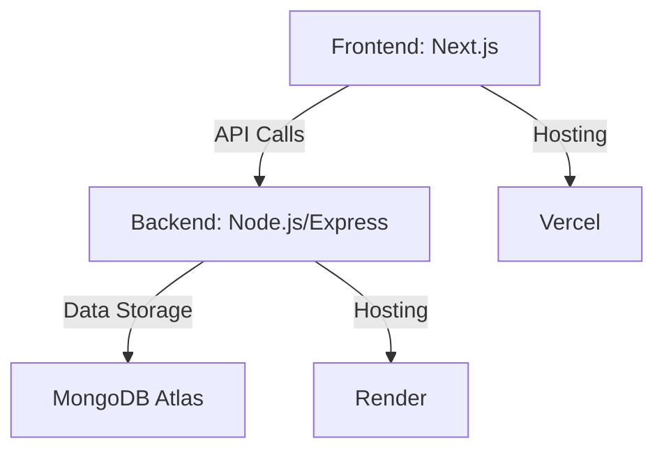

# HIGO Analytics Dashboard

  
*Main dashboard showing customer data summary*

  
*Detailed customer data table view*

## Overview

This project provides a comprehensive solution for analyzing and visualizing customer data with:

- **Backend**: Node.js/Express.js hosted on Render
- **Frontend**: Next.js hosted on Vercel  
- **Database**: MongoDB Atlas

## Features

- 📊 **Interactive Visualizations**: Gender distribution and location analysis charts
- ♀️♂️ **Demographic Insights**: Age statistics and customer segmentation
- 🖥️ **Responsive Design**: Works on all device sizes
- ⚡ **Fast API**: Responses under 30 seconds guaranteed

## Technical Stack



## Project Structure

Here's the annotated project structure with explanations for each item:

```
HiGO-Analytics/                     # Root project folder
│
├── backend/                        # Backend server code
│   ├── config/                     # Configuration files (Mongo DB)
│   ├── controllers/                # Business logic handlers
│   ├── models/                     # Database models/schemas
│   ├── routes/                     # API endpoint definitions
│   ├── utils/                      # Helper functions/utilities
│   ├── app.js                      # Express application setup
│   ├── package-lock.json           
│   ├── package.json                
│   └── server.js                   # Server entry point
│
└── frontend/                       # Frontend application
    ├── public/                     # Static assets (fonts, images, etc.)
    ├── src/                        # Main application source code
    ├── .eslintrc.json              # ESLint configuration
    ├── jsconfig.json               # JavaScript path aliases
    ├── next.config.js              
    ├── package-lock.json           
    ├── package.json                
    ├── postcss.config.js           # PostCSS configuration
    ├── README.md                   # Frontend documentation
    └── tailwind.config.js          # Tailwind CSS configuration
```

Here's the updated deployment section with comprehensive instructions for both development and production:

## Development & Deployment

### Backend Setup (Node.js/Express)

```bash
# 1. Install dependencies
cd backend
npm install

# 2. Set up environment variables
echo "MONGO=your_mongodb_connection_string" > .env
echo "PORT=5000" >> .env

# 3. Import initial data (optional)
npm run import  # Imports from Customer.csv (If you want to run this make sure you have Dataset.csv on data folder)

# 4. Run in development mode
npm run dev     # Uses nodemon for live reload

# 5. For production
npm install --production
npm start       # Uses node server.js
```

### Frontend Setup (Next.js)

```bash
# 1. Install dependencies
cd frontend
npm install

# 2. Configure environment
echo "NEXT_PUBLIC_API_BASE_URL=http://localhost:5000" > .env.local

# 3. Run development server
npm run dev     # Port 3000 by default

# 4. Production build
npm run build   # Creates optimized production build
npm start       # Starts production server
```

### Deployment Guides

**Backend to Render:**
1. Create new `Web Service` on Render
2. Connect your GitHub repository
3. Set environment variables:
   - `MONGO`: Your MongoDB Atlas connection string
   - `PORT`: 10000 (Render's default)
4. Set build command: `npm install`
5. Set start command: `node server.js`

**Frontend to Vercel:**
1. Import project from GitHub
2. Automatic detection for Next.js
3. Add environment variable:
   - `NEXT_PUBLIC_API_BASE_URL`: Your Render backend URL (e.g., `https://your-backend.onrender.com`)
4. Deploy (no build configuration needed)

### Important Notes:
#### For continuous deployment:
   - Enable GitHub webhooks in both Render and Vercel
   - Main branch pushes will trigger automatic redeploys