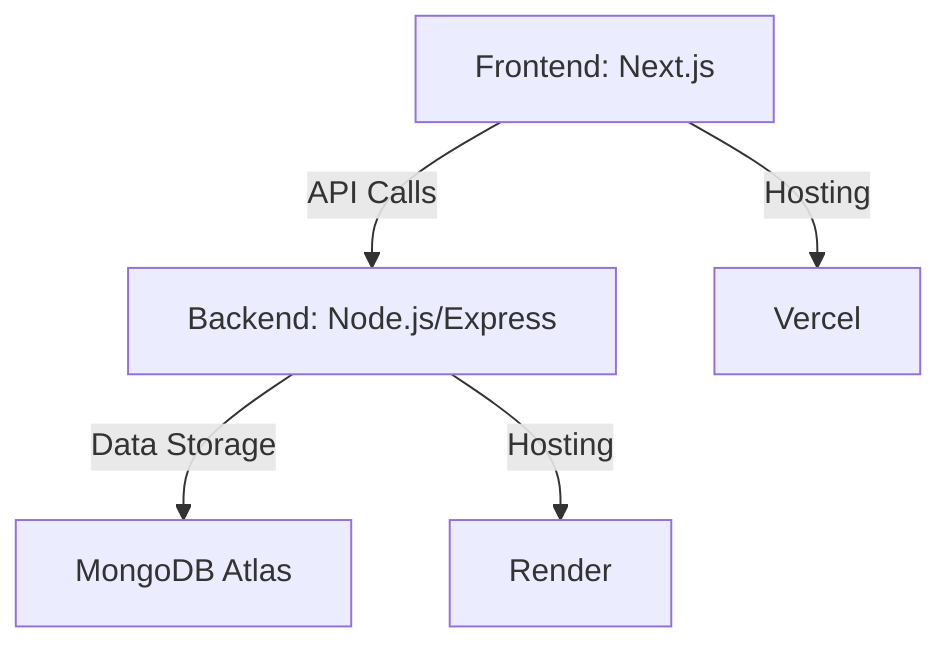

# HIGO Analytics Dashboard

  
*Main dashboard showing customer data summary*

  
*Detailed customer data table view*

## Overview

This project provides a comprehensive solution for analyzing and visualizing customer data with:

- **Backend**: Node.js/Express.js hosted on Render
- **Frontend**: Next.js hosted on Vercel  
- **Database**: MongoDB Atlas

## Features

- 📊 **Interactive Visualizations**: Gender distribution and location analysis charts
- ♀️♂️ **Demographic Insights**: Age statistics and customer segmentation
- 🖥️ **Responsive Design**: Works on all device sizes
- ⚡ **Fast API**: Responses under 30 seconds guaranteed

## Technical Stack



## Setup Instructions

### Backend (Render)
1. Set environment variable in Render dashboard:
   ```env
   MONGO=<your-mongodb-atlas-uri>
   ```

### Frontend (Vercel)
1. Configure environment variable:
   ```env
   NEXT_PUBLIC_API_BASE_URL=<your-render-backend-url>
   ```

## Project Structure

```
root/
├── backend/       # Express.js API code
├── frontend/      # Next.js application
├── images/
│   ├── dashboard-overview.png
│   └── data-details.png
└── README.md
```

## Development

```bash
# Backend
cd backend
npm install
npm run import # to import csv data
npm run dev

# Frontend
cd frontend
npm install
npm run dev
```
